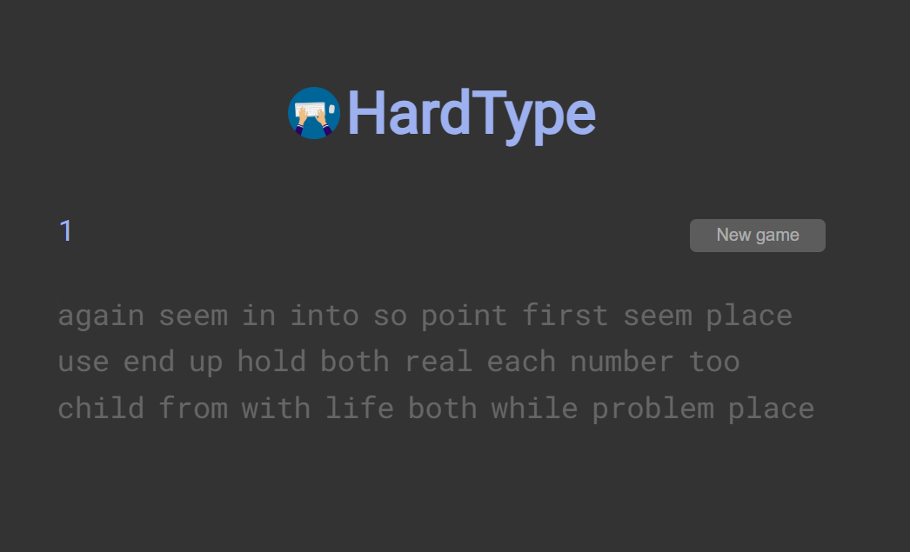

# 🎯 HardType - A Typing Speed Game

**HardType** is a minimalistic and responsive typing speed game built using pure HTML, CSS, and JavaScript. It helps users test and improve their typing speed by measuring their WPM (Words Per Minute) over a 30-second challenge.

---

## 🔥 Features

- ⌛ 30-second countdown timer  
- 💬 Random word generation (200+ words per game)  
- 🔠 Real-time character validation with color feedback  
- ⌨️ Keyboard focus detection and accessibility  
- 🚀 Smooth animations and blinking cursor  
- 📱 Fully responsive and mobile-friendly

---

## 🖼️ Preview




---

## 📁 Project Structure

```
HardType/
├── index.html         # Main HTML file
├── styles.css         # Styling and animations
├── typing.js          # Game logic (WPM, timer, word generation)
├── logo.png           # Game logo
└── screenshot.png     # Screenshot for preview
```

---

## 🚀 How to Run

1. Clone this repository:
   ```bash
   git clone https://github.com/gandham-venkatesh/hardtype.git
   cd hardtype
   ```

2. Open the game in your browser:
   - You can simply **double-click `index.html`**, or
   - Serve it using Live Server (recommended for development):
     ```bash
     live-server
     ```

---

## 🧠 How It Works

- **Words Display**: 200 random words are selected from a large pool.
- **Typing**: You type the words, and each keystroke is validated in real-time.
- **Scoring**: Only correctly typed words without any error are counted.
- **WPM Calculation**:
  ```
  WPM = (Correct words / Time in ms) * 60000
  ```

---

## 🧪 Sample Code Snippets

**Start New Game**
```js
function newGame() {
  document.getElementById('words').innerHTML = '';
  for (let i = 0; i < 200; i++) {
    document.getElementById('words').innerHTML += formatWord(randomWord());
  }
  // ...
}
```

**WPM Calculation**
```js
function getWpm() {
  const typedWords = ...;
  return correctWords.length / gameTime * 60000;
}
```

---

## ✅ TODOs (Optional Enhancements)

- Add difficulty levels (easy/medium/hard)
- Add a leaderboard (using localStorage or backend)
- Allow user to select duration (30s, 60s, 90s)
- Mobile UI improvements (bigger input area, vibration feedback)
- Sound effects for correct/incorrect keystrokes

---

## 📦 Tech Stack

- **Frontend**: HTML5, CSS3, JavaScript (Vanilla)
- **Fonts**: Roboto & Roboto Mono via Google Fonts
- **Icons & Cursor**: CSS animations

---

## 👨‍💻 Author

Made with ❤️ by [Gandham Venkatesh](https://github.com/gandham-venkatesh)

If you like this project, give it a ⭐ and consider following me on GitHub!

---


